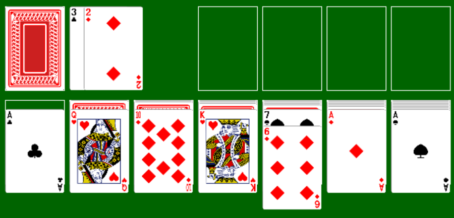
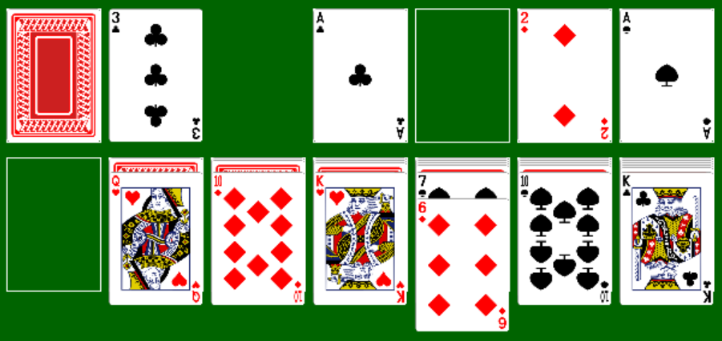
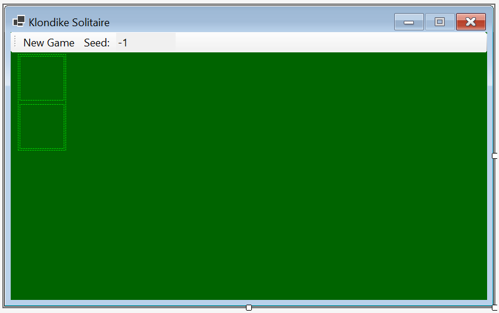
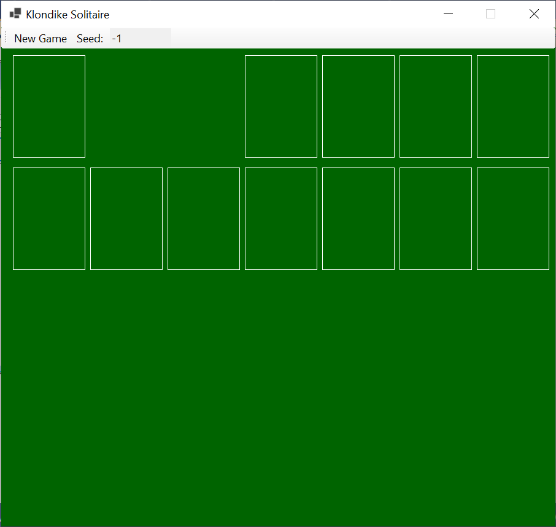

# Homework Assignment 1: Klondike Solitaire

For this assignment, you will complete an implementation of the Klondike Solitaire game.

## 0. Contents

[TOC]

## 1. User Requirements

A company wants to distribute an implementation of the game, Klondike Solitaire. A portion of the program has already been written, but you will need to supply the game logic. Your implementation should include the following features:

- Verification that the player's moves are legal (see below).
- Notification of the end of the game.

## 2. Cards

Klondike is a Solitaire game played with a standard deck of 52 cards. Each card in this deck is uniquely identified by its *rank*, an integer value from 1 to 13, and a *suit*, either "spades", "clubs", "hearts", or "diamonds". Cards with ranks 2 through 10 have that value, along with their suit, in the upper-left and lower-right corners. The other four ranks have special names, the first letter of which is shown in the upper-left and lower-right corners, along with their suit. These names are:

- Rank 1: "Ace"
- Rank 11: "Jack"
- Rank 12: "Queen"
- Rank 13: "King"

The suits spades and clubs are black, and the suits hearts and diamonds are red.

### 2.1. Examples

- Ace of spades:
  
- King of clubs:
  
- Queen of hearts:
  
- 2 of diamonds:
  

## 3. Rules

The cards are initially dealt into seven *tableau columns* by repeating the following until all tableau columns contain a face-up card:

- Place the next card from the deck face up on top of the leftmost tableau column that does not contain a face-up card.
- Place one card from the deck face down on each remaining tableau column that does not contain a face-up card, starting from the left.

The remaining 24 cards in the deck form the *stock*. For example, the following figure illustrates how the cards might be dealt, where the stock is in the upper-left corner and the seven tableau columns are across the bottom:

Note that the first tableau column has no face-down cards, and each successive column has one more face-down card than the one to its left.

The goal of the game is to move all of the cards to the four *foundations*, which are shown as empty boxes in the upper-right of the above figure, by repeatedly doing any of the following:

- **Take cards from stock:** If cards remain in the stock, draw three cards from the top and place them face up on the *discard pile* next to the stock. If the stock contains fewer than three cards, place all of them on the discard pile. When doing this, the order of the cards should be reversed; for example, the following figure shows the result of this action if the 3 of clubs had been the top card on the stock, the 2 of diamonds had been next, and the 6 of diamonds had been next:
  
- **Move a card from the discard pile to a nonempty tableau column:** The top card from the discard pile may be moved on top of a nonempty tableau column if its rank is one less than the rank of the top card on the tableau column and its color is different. In the above example, we can move the 6 of diamonds on top of the 7 of spades:
  
- **Move a card to a foundation:** Any ace may be moved from the top of a tableau column or the discard pile to an empty foundation. Any other card may be moved from the top of a tableau column or the discard pile to a nonempty foundation if it has the same suit as the card on the top of the foundation and has a rank one larger. If the card being moved is the only face-up card on a tableau column and there are face-down cards on that column, the top face-down card is turned face up. For example, all three aces above may be moved to empty foundations, and the 2 of diamonds may then be moved on top of the ace of diamonds:
  
- **Move cards from one tableau column to a nonempty tableau column:** One or more face-up cards from the top of a tableau column may be moved on top of a nonempty tableau column if the bottom card being moved has rank one smaller than the card upon which it is being placed, and these two cards are of different colors. If all of the face-up cards from a tableau column are moved and there are face-down cards on this column, the top face-down card is turned face up. In the above example, the queen of hearts may be moved on top of the king of clubs:
  
- **Move cards to an empty tableau column:** The top card from the discard pile or all of the face-up cards on a tableau column may be moved to an empty tableau column if the bottom card being moved is a king. If cards are moved from a tableau column containing face-down cards, the top face-down card is turned face up. In the above example, the king of clubs and queen of hearts may be moved to the empty tableau column:
  
- **Return the discard pile to stock:** If the stock is empty and the discard pile is not, the discard pile may be turned face down and returned to stock. In the example below (in which the discard pile contains more cards below the three that are showing), the 3 of diamonds will become the bottom card of the stock:
  

Suppose that at some point, the following conditions both hold:

- At most one card remains in the stock and discard piles combined.
- No face-down cards remain in any tableau column.

In such a situation, it is always possible to reach the goal of moving all cards to the foundations. Therefore, in order to skip the tedium of moving the remaining cards to foundations, we will consider that the player has won if both of the above conditions hold.

Play continues until the player either wins or gives up. 

## 4. Starting the Assignment

Create your GitHub repository using the link provided on the Canvas assignment. This repository contains a running program, but with little functionality. It also contains a unit test project.

The design window for **UserInterface.cs** should contain a form that looks like:

You will **not** need to change this. Additional graphics are added by the provided code. If you run the program, you should see the following GUI (don't worry if the boxes don't line up vertically on your display):

The only functionality this program will have is that clicking the "Seed:" button will cause the following modal dialog to be displayed:

The **NumericUpDown** in this dialog can be set to any integer value *n*, where -1 &leq; *n* &leq; 1,000,000. If the dialog is closed by clicking the "X" in the upper-right corner, the main GUI is unaffected. Otherwise, if the "OK" button is clicked or `Enter` is pressed, the dialog closes, and the value to the right of "Seed:" on the menu bar is replaced by the value from the **NumericUpDown** in the dialog. 

Much of the program code is provided, including all code for rendering graphics and code for getting a shuffled deck of cards. You will need to add code implementing the game logic, including dealing the cards, as described in [7. Coding Requirements](#7. Coding Requirements) below. Several types have been defined for your use. All of this is described in detail in what follows.

## 5. User Interface

The desired behavior of your finished program is summarized here. Some of this behavior is illustrated in the [demo video](https://youtu.be/at2VcEqD9f0), posted on the Canvas assignment.

The program should start by displaying the window shown by the provided code (see [4. Starting the Assignment](#4. Starting the Assignment]) above). The user may change the value of the seed as described above.

Whenever the user clicks the "New Game" button, a new game should be dealt and displayed. If the value of the seed is nonnegative, the same game should be dealt whenever the seed has this value. If its value is -1, a random game should be dealt.

During game play, after a game is dealt, the user can do any of the actions listed under "Rules" above by making either one or two mouse clicks, depending on the action. For actions that require two clicks, the first click will select one or more cards, and the second will complete the action. Selected cards will be indicated on the GUI with a magenta box drawn around the cards. Specifically, the program should respond as follows to mouse clicks on various locations of the game board:

- If the stock is clicked when it is nonempty, cards are moved from the stock to the discard pile, as described under "Rules" above. If there was a selection at the time of the click, the selection is removed.
- If the stock area is clicked when the stock is empty, cards are moved from the discard pile back to the stock, as described under "Rules" above. If there was a selection at the time of the click, the selection is removed.
- If the top card in the discard pile is clicked when the discard pile is nonempty and there is no selection, this card is selected.
- If a face-up card on a tableau column is clicked when there is no selection, this card and all cards shown on top of it are selected.
- If a foundation, the top card on the discard pile, the top card on a tableau column, or an empty tableau column is clicked when a selection exists, the selected cards are moved on top of the clicked card/area, provided this move is legal as described under "Rules" above. If this move is illegal, no cards are moved. In either case, the selection is removed. (Note that clicking the top card on the discard pile when a selection exists, or clicking a foundation area when the number of selected cards is more than 1, always results in an illegal move.)
- Any other clicks within the green game board area are ignored.

If the user wins, as described under "Rules" above, a **MessageBox** containing the message, "You win!", is displayed, and any subsequent clicks within the green game board area are ignored until the "New Game" button is clicked again.

## 6. Software Architecture

The following class diagram shows the types defined in this program:

Each box in the above diagram is a type defined in the program. All of these types have already been defined in the provided code, but the **Game** and **TableauQueue** classes are incomplete. These classes are the only code you will need to modify. The **Game** class is responsible for setting up a new game and controlling the game logic. The **TableauQueue** class implements a variation on a queue that allows the user to peek at either the front or the back. These queues will be used to store the face-up cards on each tableau column such that when the queue is nonempty, the card at the back of the queue is the uncovered card on the column. The other types are:

- The **UserInterface** class, which implements the main form. You will not need to use this class in your code.
- The **SeedDialog** class, which implements the dialog for obtaining a new seed. You will not need to use this class in your code.
- The **CardPile** class, which implements a graphical control for displaying the stock or a foundation pile.
- The **DiscardPile** class, which implements a graphical control for displaying the discard pile.
- The **TableauColumn** class, which implements a graphical control for displaying a tableau column.
- The **Suit** enumeration, which provides identifiers for each of the four suits.
- The **Card** class, which implements a single card.
- The **CardPainter** class, which is a **static** class containing constants, properties, and methods used for drawing. You will not need to use this class in your code.

Below, we will describe what you will need to use from each of the above types. First, however, we need to explain the meaning of the arrows in the above diagram.

Single-headed arrows from one type to another in the diagram indicate fields or properties defined within the type at the source of the arrow. The type of such a field or property is the type at the destination of the arrow. For example, `_selectedColumn` is a field within the **Game** class having type **TableauColumn**. Double-headed arrows are similar, but represent collections of the type at the destination of the arrow. For example, within the **TableauQueue** class, **FaceDownPile** is a property that gets a collection of **Card**s. In this case, the collection is a stack, but some of the collections shown above are arrays or queues.

### 6.1. The Suit Enumeration

This enumeration contains four members:

- **Suit.Clubs**
- **Suit.Diamonds**
- **Suit.Hearts**
- **Suit.Spades**

### 6.2. The Card Class

You will need to use the following constants defined within this class:

- **MinRank**: an **int** giving the minimum rank of any card (1).
- **MaxRank**: an **int** giving the maximum rank of any card (13).

You will also need to use the following properties of a **Card**:

- **Rank:** gets an **int** giving the rank of the card (see  [2. Cards](#2. Cards) above).
- **Suit:** gets a **Suit** giving the suit of the card (see [2. Cards](#2. Cards) above).
- **IsRed**: gets a **bool** indicating whether the card is red (if not, it is black - see [2. Cards](#2. Cards) above).

### 6.3. The CardPile Class

You will only need to use the **Pile** property of a **CardPile**. This property gets a **Stack\<Card\>** giving the cards in the pile. The top of the stack is the top card on the pile.

### 6.4. The DiscardPile Class

You will need to use the following properties of a **DiscardPile**:

- **Pile:** gets a **Stack\<Card\>** giving the cards in the pile, where the top of the stack is the top card on the pile.
- **IsSelected:** gets or sets a **bool** indicating whether the top card on the pile is selected. If this property is **true**, the top card will be drawn with a magenta box around it. If it is assigned **true** when the **Pile** property is empty, it throws an **InvalidOperationException**.

### 6.5. The TableauColumn Class

You will need to use the following properties of a **TableauColumn**:

- **FaceDownPile:** gets a **Stack\<Card\>** giving the face-down cards in the column, where the top of the stack is the top face-down card on the pile.
- **FaceUpPile:** gets a **TableauQueue** giving the face-up cards in the column, where the back of the queue is the top face-up card on the column (i.e., the card that is uncovered).
- **NumberSelected:** get or sets an **int** giving the number of cards in the column that are selected. If this property is positive, a magenta box is drawn around this many face-up cards at the top of the column. If this property is assigned a negative value or a value greater than the number of face-up cards, it throws an **ArgumentOutOfRangeException**. (Note that this does not guarantee that this property will always be in range, as elements can be removed from **FaceUpPile** after a value is assigned to **NumberSelected**.)

## 7. Coding Requirements

In what follows, we give specific requirements for your program code. Note that you do not need to use the names that are shown in the class diagram above for any members hat you add, as long as you follow the [naming conventions](https://textbooks.cs.ksu.edu/cis300/appendix/style/naming/) for this class. However, don't change the names of any provided members. Note that some of the classes define various constants, using either **const** or **static readonly**. Use these constants in your code rather than their literal values.

### 7.1. The TableauQueue Class

The provided code for this class includes trivial code for the **public** property and the six **public** methods. You will need to complete each of these. The comments above each **public** member describe what they are to do. For most of them, you can simply call a member of the **[Queue](https://learn.microsoft.com/en-us/dotnet/api/system.collections.generic.queue-1?view=net-6.0)\<Card\>** `_queue`. Two of the methods, however, require a bit more work:

- The **Enqueue** method, in addition to enqueueing the given **Card** onto the **Queue\<Card\>**, needs to save this card in the **Card** field `_backCard`, which keeps track of the back card in the queue.
- The **PeekBack** method first needs to determine whether the queue is empty, and if so, throw an **InvalidOperationException**. Otherwise, it should return the card at the back of the queue, which is stored in a **private** field.

### 7.2. The Game Class

First, you will need to add four **private** fields:

- A **DiscardPile?** and a **TableauColumn?** to keep track of the currently-selected discard pile or tableau column. A **null** value indicates that no discard pile or tableau column, respectively, is selected. Note that in order for any selection to be displayed properly, the appropriate properties of the discard pile and all tableau columns need to be set accordingly.
- Two **int**s to keep track of the number of face-down tableau cards and the number of cards in the stock and discard pile together. Initialize these values using the provided constants `_initialHiddenCardCout` and `_initialStockCount`, respectively. These initial values represent the number of cards in the respective group after the cards are dealt.

You will also need to add 14 **private** methods and complete the provided constructor and the four provided **public** methods. Each of these is discussed in what follows. We will divide the **private** methods into two groups. Methods in the first group will perform more fundamental tasks that are needed in more than one place. Methods in the second group will make the various moves of the game, including dealing the cards initially. The constructor will initialize a **Game** object to the beginning of a game. The **public** methods will implement the needed functionality for the event handlers provided in the **UserInterface** class. 

Unless otherwise indicated, you will not need to do any error-checking (such as checking that a variable is non-**null** or has a value in the proper range) on any of the parameters.

#### 7.2.1. Low-Level Methods

The following methods each implement a low-level action that needs to be done in more than one place. You should use one of the first four of these methods whenever cards need to be moved from one stack or queue to another.

##### 7.2.1.1. A private method to transfer one card from a stack to a TableauQueue

This method should take as its parameters a **Stack\<Card\>** and a **TableauQueue**. It should return nothing. It should move one card from the top of the stack to the back of the queue.

##### 7.2.1.2. A private method to transfer one card from a TableauQueue to a stack

Consider naming this method the same as the one above, as this might make these two methods easier to use. This method should take as its parameters a **TableauQueue** and a **Stack\<Card\>**. It should return nothing. It should move one card from the front of the queue to the top of the stack. 

##### 7.2.1.3. A private method to transfer cards from one stack to another

This method should take as its parameters two **Stack\<Card\>**s and an **int** giving the number of cards to move. It should return nothing. It should move the given number of cards, one at a time, from the top of the first stack to the top of the second stack. Thus, the last card removed from the first stack will end up at the top of the second stack. Note that because the third parameter can be 1, this method can be used even if only one card is being moved.

##### 7.2.1.4. A private method to transfer cards from one TableauQueue to another

Consider naming this method the same as the one above. This method should take as its parameters two **TableauQueues** and an **int** giving the number of cards to move. It should return nothing. It should move the given number of cards, one at a time, from the front of the first queue to the back of the second. Note that if the same queue is used for both queue parameters, this will cause the cards to be moved from the front to the back of this queue, preserving the order of the cards moved.

##### 7.2.1.5. A private method to remove any selection

This method needs no parameters and should return nothing. It needs to check each of the **private** fields that keep track of selected piles to see if they are non-**null**. If either is, update the appropriate property of the selected pile so that no cards are selected, then set the **private** field to **null**.

##### 7.2.1.6. A private method to determine whether a card can be placed on a tableau column

This method needs as its parameters a **Card** giving the card to be moved and a **TableauQueue** giving the pile of face-up tableau cards to which it is to be moved. It should return a **bool** indicating whether the given card can legally be placed on top of the card at the back of the queue. Make this determination according to the rules given in [3. Rules](#3. Rules) above. It should **not** place the card on the pile. Be careful to handle the case in which the given queue is empty (you may assume it isn't **null**).

##### 7.2.1.7. A private method to determine whether a card can be placed on a foundation pile

This method should take as its parameters a **Card** giving the card to be moved and a **Stack\<Card\>** giving the foundation pile on which it is to be moved. It should return a **bool** indicating whether the given card can legally be placed on the given foundation pile, as described in [3. Rules](#3. Rules) above. It should **not** place the card on the pile. Be sure to handle the case in which the foundation pile is empty.

##### 7.2.1.8. A private method to determine whether the game has been won

This method should take no parameters. It should return a **bool** indicating whether the game has been won. Use the **private int** fields to make this determination as described in [3. Rules](#3. Rules) above.

##### 7.2.1.9. A private method to flip a tableau column card

This method should take as its only parameter a **TableauColumn** giving the column to check. It should return nothing. It will need to determine whether the column has no face-up cards but at least one face-down card. If so, it will need to move the top face-down card to the face-up pile and update the field keeping track of the number of face-down tableau cards.

#### 7.2.2. Methods to Make Game Moves

The following methods each implement either a play of the game or dealing the cards initially.

##### 7.2.2.1. A private method to deal the cards

This method should take the following parameters:

- A **Stack\<Card\>** giving the deck of cards.
- A **TableauColumn[&nbsp;]** giving the tableau columns to which the cards will be dealt.

It should deal the cards as described in [3. Rules](#3. Rules) above. It is important to deal the cards in this order; otherwise, the game won't be the same as is shown in the [demo video](https://youtu.be/at2VcEqD9f0) or as is used in the unit test code. Use the appropriate methods above to move each card from one stack to another or to a **TableauQueue**.

##### 7.2.2.2. A private method to move a card from the discard pile to a tableau column

This method should take as its parameters a **Stack\<Card\>** giving the cards on the discard pile and a **TableauQueue** giving the tableau pile onto which the card is to be moved. It should return nothing. This method is responsible for moving the top card from the discard pile to the given tableau pile, provided this move is legal, as described in [3. Rules](#3. Rules) above. You may assume that the discard pile is nonempty. Using the appropriate methods above, determine whether the move is legal, and if so, move the card and update the appropriate **int** field.

##### 7.2.2.3. A private method to move a card from the discard pile to a foundation pile

This method should take as its parameters a **Stack\<Card\>** giving the cards on the discard pile and a **Stack\<Card\>** giving the foundation pile onto which the card is to be moved. This method is responsible for moving the top card from the discard pile to the given foundation pile, provided this move is legal, as described in [3. Rules](#3. Rules) above. You may assume the discard pile is nonempty.

##### 7.2.2.4. A private method to move the selected cards from one tableau column to another

This method should take as its parameters a **TableauColumn** giving the column from which the cards are to be removed and a **TableauQueue** giving the tableau pile onto which the cards are to be placed. It should return nothing. You may assume that there is at least one card selected on the given tableau column. This method is responsible for moving those selected cards to the given tableau pile, provided the move is legal as described in [3. Rules](#3. Rules) above.

First, using the appropriate method above, move the cards that are **not** selected on the given **TableauColumn** to the back of this column's queue (i.e., the cards are moved from the front of the queue to the back of the same queue). This will have the effect of bringing the first selected card to the front of the queue. Then, using the appropriate method above, determine whether the front card in this queue can legally be moved to the back of the given **TableauQueue**. If so, move the selected cards to this queue, and using the appropriate method above, flip a face-down card (if necessary) on the given column. Otherwise, restore the given **TableauColumn** to its original state by moving the selected cards to the back of this column's queue.

##### 7.2.2.5. A private method to move a card from a tableau column to a foundation pile

This method should take as its parameters a **TableauColumn** giving the column from which the card is to be removed and a **Stack\<Card\>** giving the foundation pile onto which the card is to be placed. It should return nothing. This method is responsible for moving the back card on the given column's queue to the given foundation pile, provided the move is legal as described in [3. Rules](#3. Rules) above. 

First, using the appropriate method above, determine whether this move is legal. If so:

- Bring the back card in the **TableauColumn**'s queue to the front by moving all other cards to the back.
- Move the front card to the given stack.
- Using the appropriate method above, flip a face-down card on the column (if necessary).

#### 7.2.3. Public Constructor and Methods

Stubs for these members are given in the provided code. You will need to **replace** any code provided inside the methods with code that will accomplish the given tasks; however, you should not change the method signatures (i.e., the return types, method names, or parameter lists). Be sure to use any appropriate **private** methods above. The **public** methods are defined so that the parameters describe which cards were chosen by the mouse click; hence, you will not need to deal with raw click locations. In most cases, however, you will need to determine whether the chosen cards represent a selection or the destination of a move.

##### 7.2.3.1. The constructor

The constructor is responsible for initializing a **Game** object for a new game. You may assume that each of the GUI controls is properly initialized (i.e., all stacks are empty and there are no cards selected). You will need to do the following:

- Initialize the [**Random**](https://learn.microsoft.com/en-us/dotnet/api/system.random?view=net-6.0). If the given seed is -1, it should be initialized using [its no-parameter constructor](https://learn.microsoft.com/en-us/dotnet/api/system.random.-ctor?view=net-6.0#system-random-ctor). This will result in a random ordering of cards. Otherwise, use [its 1-parameter constructor](https://learn.microsoft.com/en-us/dotnet/api/system.random.-ctor?view=net-6.0#system-random-ctor(system-int32)), passing it the given seed. This will allow the cards to be shuffled, but in the same order each time the same seed is used.
- Shuffle a new deck using the provided **ShuffleNewDeck** method. Use as its parameter the stock pile so that the shuffled deck becomes the stock.
- Deal the game using the appropriate method above.

##### 7.2.3.2. The DrawCardsFromStock method

This method will be called any time the stock (or stock area if the stock is empty) is clicked. Fill in the code to produce the behavior described in [5. User Interface](#5. User Interface) above. You might find the [**Math.Min**](https://learn.microsoft.com/en-us/dotnet/api/system.math.min?view=net-6.0#system-math-min(system-int32-system-int32)) method useful for determining the number of cards to flip.

##### 7.2.3.3. The SelectDiscard method

This method is called whenever the top card on the discard pile is clicked. Fill in the code to produce the behavior described in [5. User Interface](#5. User Interface) above. Note that if there is already a selection, the move is illegal.

##### 7.2.3.4. The SelectTableauCards method

This method is called whenever either an empty tableau column or a face-up card on a tableau column is clicked. You may assume that `n` is 0 only when the tableau column is empty. Replace the provided code with code to produce the behavior described in [5. User Interface](#5. User Interface) above and to return whether the play wins the game. Note that you should only make a move when `n` is *at most* 1, but you should only make a selection when `n` is *at least* 1.

##### 7.2.3.5. The SelectFoundationPile method

This method is called whenever a foundation is clicked.  Replace the provided code with code to produce the behavior described in [5. User Interface](#5. User Interface) above and to return whether the play wins the game.

## 8. Testing Your Program

Unit tests have been provided to test both of the classes you are required to complete. You should also run the program to make sure it functions, but you don't need to check all of the game functionality - this will be done by the unit tests. 

Before running the unit tests, in the Test Explorer, click on the "Group By" icon, and make sure "Class" is checked. Then uncheck any other items in the list, and finally, check "Traits". This will cause the tests to be grouped first by class (which will correspond to the class being tested), then by traits (or categories). After doing this, click on the main window, and make sure that the arrow on the "Test" column is pointing upwards - if it isn't, click on "Test" to reverse its direction. This will cause the tests to be listed in the proper order so that working through them from top down will correct the more basic issues first.

When debugging a failed test, pay attention to all of the information in the Test Detail Summary window for that test. This should tell you what went wrong. Note that in **BGameTests.cs**, the contents of stacks and queues are usually converted to arrays before comparing them with other arrays. For stacks, the arrays will list the contents from top to bottom, and for queues, the arrays will list the contents from front to back. Some of the test methods in **BGameTests.cs** are quite long. To help you to find which assertion failed, each tests has a unique message that appears in the Test Detail Summary - this message is given as the third parameter to the **Assert.That** method that failed. Also, the first line number given in the Stack Trace should be close to the failed assertion.

You will usually need to look at the unit test code and its comments to see exactly what was tested. To get to the unit test code, double-click the test in the Test Explorer. If a test throws an exception, it is usually useful to right-click on the test and select "Debug". This will run the debugger on the test and break the program execution where the exception is thrown. Once all the unit tests for a class have passed, you can be reasonably confident of that class's correctness (although this isn't guaranteed).

For some of the tests in **BGameTests.cs**, it may be helpful to run the program so that you can see exactly what is being tested. Some of the tests, including **TestSeed**, which tests the dealing of the cards, use a seed of 0 to generate a game. This game should deal the cards as follows:

The contents of the stock and the face-down cards on the tableau columns can be found in the **private** fields, `_initialStock` and `_faceDownCards`, respectively.

## 9. Submitting Your Assignment

Be sure to **commit** all your changes, then **push** your commits to your GitHub repository. Then submit the *entire URL* of the commit that you want graded. 

The repositories for the homework assignments for this class are set up to use GitHub's autograding feature to track push times. No actual testing/grading is done, but after each push, the GitHub page for the repository will show a green check mark on the line indicating the latest commit. Clicking that check mark will display a popup indicating that all checks have passed, regardless of whether your program works. You may also get an email indicating that all checks have passed. The only purpose for using the autograding feature in this way is to give us a backup indication of your push times in case you submitted your assignment incorrectly.

**Important:** We will only grade the source code that is included in the commit that you submit. Therefore, be sure that the commit on GitHub contains  **Game.cs** and **TableauQueue.cs** within the **Ksu.Cis300.KlondikeSolitaire** folder, and that it is the version you want graded. This is especially important if you had any trouble committing or pushing your code.
